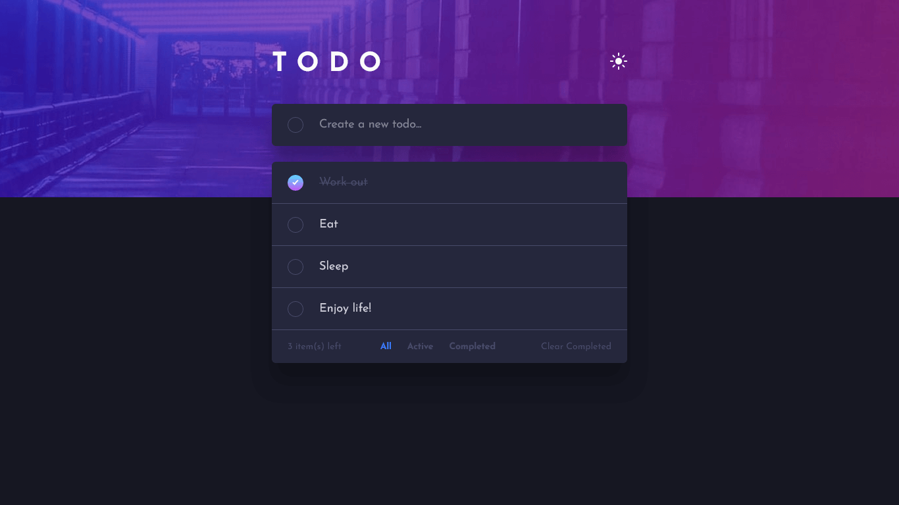

# Frontend Mentor - Todo app solution

This is a solution to the [Todo app challenge on Frontend Mentor](https://www.frontendmentor.io/challenges/todo-app-Su1_KokOW). Frontend Mentor challenges help you improve your coding skills by building realistic projects.

## Table of contents

- [Overview](#overview)
  - [The challenge](#the-challenge)
  - [Screenshot](#screenshot)
  - [Links](#links)
- [My process](#my-process)
  - [Built with](#built-with)
  - [What I learned](#what-i-learned)
  - [Useful resources](#useful-resources)
- [Author](#author)

**Note: Delete this note and update the table of contents based on what sections you keep.**

## Overview

### The challenge

Users should be able to:

- [x] View the optimal layout for the app depending on their device's screen size
- [x] See hover states for all interactive elements on the page
- [x] Add new todos to the list
- [x] Mark todos as complete
- [x] Delete todos from the list
- [x] Filter by all/active/complete todos
- [x] Clear all completed todos
- [x] Toggle light and dark mode
- [ ] **Bonus**: Drag and drop to reorder items on the list
- [x] **Bonus**: Use the app with the keyboard :)

### Screenshot



### Links

- Solution URL: [Frontend Mentor](https://www.frontendmentor.io/solutions/todo-react-hooks-context-NanEFqGBv0)
- Live Site URL: [Vercel](https://todo-app-rau.vercel.app/)

## My process

### Built with

- Semantic HTML5 markup
- CSS custom properties
- Flexbox
- [React](https://reactjs.org/) - JS library
- React Hooks
- React Context API
- [Vite](https://vitejs.dev/) - For project creation

### What I learned

In this challenge I have used some CSS selectors like `:focus-visible`, `:focus-within` to give feedback to the user when using the application through the keyboard:

```html
<form class="form">
  <input ... class="form__input" />
</form>
```

```css
.form__input:focus-visible {
  outline: 0;
}
.form:focus-within {
  outline: thin solid red;
}
```

And also made an experiment with `[data-*]` to apply styles based on a "state".

```html
<div class="component" data-count="0"></div>
```

```css
.component:not([data-count='0']) {
  /* Styles based on state */
}
```

### Useful resources

- [Create a gradient border in CSS](https://nikitahl.com/gradient-border-css)
- [How to Build Your Own React Hooks: A Step-by-Step Guide](https://www.freecodecamp.org/news/how-to-create-react-hooks/)
- [How to Use the React Context API in Your Projects](https://www.freecodecamp.org/news/context-api-in-react/)
- [Window: localStorage property](https://developer.mozilla.org/en-US/docs/Web/API/Window/localStorage)
- [:focus-within](https://developer.mozilla.org/en-US/docs/Web/CSS/:focus-within)

## Author

- Frontend Mentor - [@raubaca](https://www.frontendmentor.io/profile/raubaca)
- Twitter - [@raubaca](https://www.twitter.com/raubaca)
- LinkedIn - [Raúl Barrera Castiblanco](https://www.linkedin.com/in/raubaca/)
- CodePen [Raúl Barrera](https://codepen.io/raubaca)
